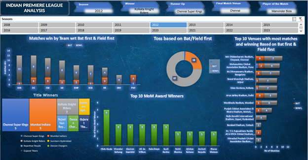

# Excel_IPL Seasons Analysis Dashboard

## Overview

This repository contains an interactive Excel dashboard analyzing the Indian Premier League (IPL) cricket seasons from 2008 to 2023. The dashboard visualizes key metrics such as team performances, match outcomes, title winners, venue statistics, and individual awards. Built using Microsoft Excel's charting and pivot table features, it provides cricket enthusiasts, analysts, and fans with an easy-to-explore view of IPL history.

The dashboard highlights trends like:
- Matches won by teams batting first vs. bowling first.
- Distribution of wins across seasons.
- Title winners and runner-ups.
- Top venues based on matches played and outcomes.
- Top Man of the Match (MOM) award winners.

## Features

- **Season-wise Breakdown**: Bar charts showing matches won by batting first (BAT) vs. bowling first (BOWL) for each IPL season (2008–2023).
- **Title Winners Visualization**: Stacked bar chart displaying the number of titles won by each team, with runner-up highlights.
- **Venue Analysis**: Top 10 venues ranked by total matches and wins based on batting/fielding first.
- **MOM Awards**: Horizontal bar chart of the top 10 players with the most Man of the Match awards.
- **Interactive Elements**: Pivot tables and slicers in Excel allow filtering by season, team, or venue for deeper exploration.

## Screenshots

*(Full dashboard view showing seasons, match wins, title winners, venues, and MOM awards.)*

## Data Sources

- Dataset sourced from Kaggle.
Note: Data is historical up to 2023; for recent seasons, update the source CSV/Excel file manually.

## Technologies & Tools

- **Microsoft Excel**: Core tool for data processing, pivot tables, and visualizations.
- **Charts Used**: Column/Bar charts, Pie charts, Stacked bars.
- **No external dependencies** – Runs entirely in Excel.

## Contributing

Contributions are welcome! If you'd like to:
- Add data for IPL 2020+ seasons.
- Suggest new visualizations (e.g., player stats, economy rates).
- Fix bugs or improve interactivity.

## Author

- **Created by**: Rishav Vishnoi
  
*Stars and feedback appreciated! 🏏*

